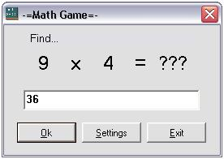



## \[  Math\-Game  \]

### Description

This code proposes math operations depending on the difficulty level and on the game mode the player chose.

I did this for my little bros, so don't expect to have fun or be super captivated...

It can be neat if you have kids and want them to work on their math.
 
### More Info
 

             |
---                |---
**Submitted On**   |2004-01-09 17:02:18
**By**             |[angelica c](https://github.com/Planet-Source-Code/PSCIndex/blob/master/ByAuthor/angelica-c.md)
**Level**          |Beginner
**User Rating**    |3.9 (35 globes from 9 users)
**Compatibility**  |VB 5\.0, VB 6\.0
**Category**       |[Math/ Dates](https://github.com/Planet-Source-Code/PSCIndex/blob/master/ByCategory/math-dates__1-37.md)
**World**          |[Visual Basic](https://github.com/Planet-Source-Code/PSCIndex/blob/master/ByWorld/visual-basic.md)
**Archive File**   |[\[\_\_Math\-Ga169209192004\.zip](https://github.com/Planet-Source-Code/angelica-c-math-game__1-50883/archive/master.zip)

